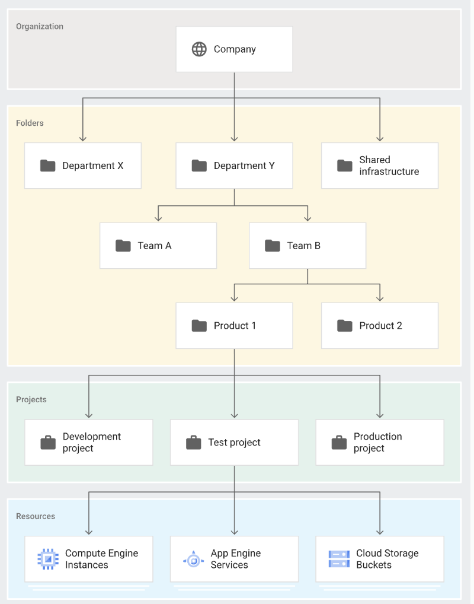

# 리눅스

## 셀이란 무엇인가요?
* 리눅스 커널과 유저를 연결해주는 인터페이스

## 셀에서 명령의 세가지 의미를 설명하시오
* 하나의 단어로 이름 붙여진 실행 가능한 프로그램. (셀 내장명령)
* 단순 명령 : 프로그램 + 명령 인수
* 결합 명령 : 단순 명령이 여러 개 있는 것

## 셸의 역할 세 가지
* 패턴 매칭 평가(와일드 카드 처리)
* 프로그램 명령 실행
* 파이프라인 처리

## 표준 입력과 출력이 무엇인지 설명하시오
* 표준 입력 : 리눅스 운영체제가 키보드를 통해 입력 받는 입력 스트림
* 표준 출력 : 화면에 결과를 출력하는 출력 스트림

## 셸에서 상속되는 3개의 표준스트림을 설명하시오.
* 표준 입력: 키보드로부터 입력되는 입력스트림
* 표준 출력: 터미널로 나가는 출력 스트림
* 표준 오류: 오류 데이터를 기록하는 출력 스트림 / 표준출력과 별개

## 셀에서 파이프란?
* 한 명령어의 출력값을 다른 명령어의 입력값으로 보내는 역할을 한다.
* 두 명령 사이에 삽입하여 명령을 조합하는 역할을 한다.

## 현재 디렉토리 이름을 영어로 2개
* current directory
* working directory

## 절대경로와 상대경로를 서술하시오.
* 절대경로 : 루트에서 시작하는 경로
* 상대경로 : 현재 디렉터리에서 시작하는 경로

## 셸 초기화파일의 전체 디렉터리를 쓰시오.
```sh
~/.bashrc
```

## /bin에 존재하는 파일 내용을 라인별 한 화면에 나타나도록 출력하는 방법
```sh
ls -l /bin | less
```

## 변수 USER 값을 출력하시오.
```sh
echo $USER
```

## 다음 두 명령행의 차이는?
```sh
echo "Welcome, $USER"
# => $USER 변수가 평가되어 출력
echo 'Welcome, $USER'
# => $ 기능 해제, $USER 문자열 그대로 출력
```

## 디렉터리명이 "how are you?" 일때 이 디렉터리 조회
```sh
ls '"how are you?"'
```

## less 명령 실행 시 화면에서 빠져나올 때 입력하는 것은?
* q

## ls와 head의 차이를 설명하시오.
* ls는 디렉터리나 파일 목록을 조회할 때 사용
* head는 지정된 파일의 내용을 일부 조회할 때 사용

## 현재 디렉토리에 존재하는 파일 수를 출력하시오.
```sh
ls -l | wc -l
```

## 현재 디렉토리에 숨겨진 파일을 포함한 전체 개수를 세시오.
```sh
ls -a | wc -ln
```

## ls로 파일을 조회하면 어떤 결과물이 반환되는가?
* 파일명이 그대로 반환

## /bin에 존재하는 파일 중 처음 5개만 골라 앞 글자만 출력하시오
```sh
ls /bin | head -n5 | cut -c1
```

## /bin에 존재하는 파일 중 마지막 5개만 골라 앞 두글자까지 출력
```sh
ls /bin | rev | head -n5 | cut -c-2
```

## animals.txt에서 4번째 필드인 저자명 중 이름만 모두 출력하시오.
```sh
# 텍스트 예시 : python  Prog  2010  Lutz, mark
# 정답  예시 : mark
cut -f4 animals.txt | cut -d, -f2
```

## animals.txt의 1번째 필드를 출력하되, 마지막 두 글자만 출력하시오.
```sh
# 텍스트 예시 : python  Prog  2010  Lutz, mark
# 정답  예시 : on
cut -f1 animals.txt | rev | cut -c-2 | rev
```

## 명령어로 다음의 디렉토리를 구현하시오.
* 현재 위치 company
* 노란 부분의 'Forders'에 해당하는 부분을 구현

```sh
mkdir "Department X" "Shared infrastructure"
mkdir "Department Y/Team A"
mkdir "Department Y/Team B/Product 1"
mkdir "Department Y/Team B/Product 2"
# Product 2를 자주 사용하는 디렉토리로 저장후 이동
pro2="$HOME/Company/Department Y/Team B/Product 2"
cd $pro2
```

## 다음의 두 코드의 차이점을 논하시오.
* uniq sample.txt | sort
* sort | uniq sample.txt
### => uniq는 인접한 문자열의 중복을 삭제하므로 정렬 전에 실행하면 결과값에 중복된 문자열이 존재할 수 있다.<br>반면 정렬을 먼저 실행하면 모든 중복된 문자열이 인접하므로 결과값에 중복이 존재할 수 없다.

## grades 파일에서 이름의 마지막 글자만 추출했을 때 각 알파벳의 중복 개수를 세는 코드를 작성하시오.
```sh
# 파일 예시
# C Gera
# B Carm
# A Kayl
# C Liam
cut -f2 grades | rev | cut -c1 | sort | uniq -c
```

## 숫자를 기준으로 내림차순하는 명령을 단축하는 코드를 작성하시오.
```sh
alias sortnum="sort -nr"
```

## 파일 삭제시 재확인 프로세스를 rm으로 지정하는 커맨드
```sh
alias rm="rm -i"
```

## alias ls="ls -l" 에 대해 설명하시오.
=> 쉐도잉 동일한 프로그램으로 별명을 짓는 것.

=> 기존 명령보다 우선처리, 현재 셸에만 영향

## /etc/passwd 디렉터리에서 로그인하지 않은 경우의 갯수를 구하는 코드를 작성하시오.
```sh
# 예 : daemon:x:1:1:daemon:/usr/sbin:/usr/sbin/nologin
grep nologin /etc/passwd | wc -l
```

## /usr/lib에서 파일의 개수를 알아내는 코드를 작성하시오.
```sh
ls -l /usr/lib | cut -c1 | grep -v d | wc -l
```

---
# md5sum ??

## 현재 디렉토리에 100개의 .jpg 파일이 존재 가정.<br>이 중 중복된 파일이 있는지 확인하는 코드를 작성
```sh
md5sum *.jpg | cut -f1-32 | sort | uniq -c | sort -nr | grep -v "1"
```

---

# 패턴 매칭

## 짝수로 끝나는 .jpg 파일 중 모음으로 시작하는 파일을 골라라
```sh
ls [aeiouAEIOU]*[24680].jpg
```

## 파일이 classA, classB, ..., classN 까지 존재 각 반 학생의 명단이 저장되어있음<br>전체 학생 명단을 담은 student_list 파일 생성 명령은?
```sh
cat class* > student_list
```

## 현재 디렉토리에서 확장자가 세 자리 수인 파일을 검색하라.
```sh
ls *.???
```

## grades 파일을 내림차순하여 동일한 이름으로 저장
```sh
sort -r grades -o grades
```

---

## 최근 15개 명령 히스토리를 history15에 저장하는 커맨드
```sh
history 15 > history15
```

## 이전 명령의 글자(chacter)수 세기
```sh
!! | wc -c
```

## 14번 명령 히스토리를 읽는 방법은?
```sh
!14
```

## 명령 히스토리에서 echo 명령만 골라 횟수를 세고 결과를 cd_history.txt에 저장
```sh
history | grep -w echo | wc -l > ch_history.txt
```

## 명령 히스토리에서 동일한 명령이 1번만 저장되도록 하려면?
```sh
$HISCONTROL=ignoredups
```

## 명령 히스토리를 1000개 저장하도록 하는 커맨드
```sh
$HISTSIZE=1000
```

## animals.txt에서 a 를 XXX로 변경
```sh
tr a XXX < animals.txt
```

## grades 에서 A를 삭제하시오.
```sh
tr -d A < grades
```

## 현재 디렉토리에서 대문자로 시작하는 파일/디렉토리 이름을 dir.txt에 저장 (오류도 함께)
```sh
ls [A-Z]* 2> dir.txt
```

## 파일 sample.sh, sample.txt를 하위 디렉토리인 tmp 파일로 옮겨라
```sh
mv sample.sh sample.txt ./tmp
```

## animals.txt의 파일명을 mammals.txt로 변경
```sh
mv animals.txt mammals.txt
```

## notes/w5.txt를 현재 디렉토리로 복사하시오.
```sh
cp notes/w5.txt .
```

## ln의 목적을 설명하시오.
* 파일을 복사하여 동기화하기 위함
* 메모리 절약도 되고, 이후의 모든 수정이 반영됨
* 동일한 파일이 다른 디렉토리에도 존재해야 할 경우 사용

---

# 깃

## 깃의 세 가지 상태와 의미하는 바를 서술하시오.
* 수정 : 수정했지만 커밋하지 않은 상태
* 커밋 : 스냅샷이 저장된 상태
* 스테이지 : 수정한 파일을 add하여 곧 커밋할 것이라고 표현한 상태

## 새로운 파일(sample.txt)이 생성되었을 때 이 파일을 커밋하는 한 묶음의 코드를 작성해라.
```sh
git status
git add sample.txt
git commit -m "sample.txt 추가"
```